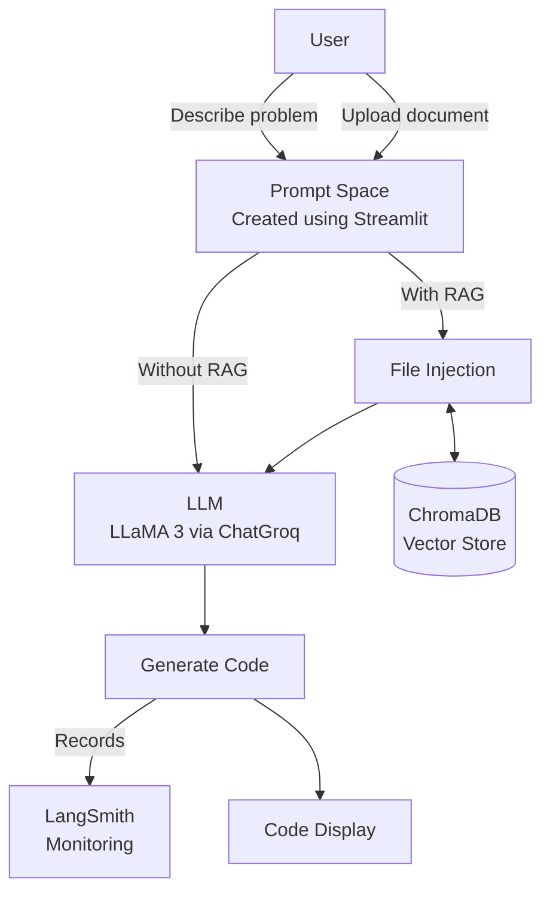
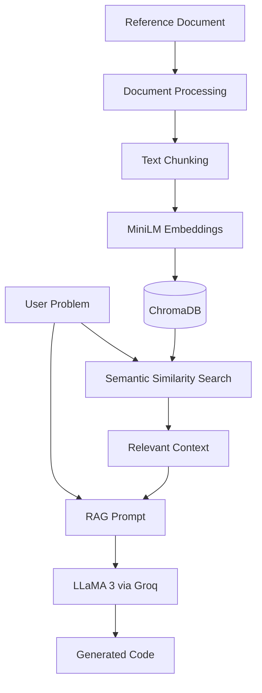

## AI Code Generator

An AI-powered code generation assistant built with Streamlit, LangChain, LLaMA 3, Groq, Hugging Face MiniLM, ChromaDB, and LangSmith.

The application converts natural-language programming problems into code and can optionally use Retrieval-Augmented Generation (RAG) to ground the generated code in user-provided reference documents.

## Overview

Traditional code-generation systems depend mainly on the knowledge encoded in an LLM. This project adds a retrieval layer so that users can provide domain-specific material such as documentation, notes, or reference files.

The system supports two modes:

Code Generator — generates code directly from the user's programming problem.
RAG Code Generator — retrieves relevant information from uploaded documents and uses that context while generating the code.

The interface is implemented using Streamlit, the LLM is accessed through ChatGroq, document embeddings are generated using Hugging Face MiniLM, and the embeddings are stored and retrieved using ChromaDB. LangSmith provides tracing and observability for the LangChain pipeline.

## Key Features

- **Natural-language to code generation**
- **Multi-language support**
  - Python
  - JavaScript
  - C++
  - Java
  - Ruby
  - Go
  - PHP
- **Optional RAG mode** for context-aware code generation
- **Reference document upload** for RAG processing
- **Semantic document retrieval** using embeddings
- **Local ChromaDB vector store** for document storage and retrieval
- **LLaMA 3-based code generation** through Groq
- **LangChain-based prompt and retrieval orchestration**
- **LangSmith tracing and monitoring** for debugging and observability
- **Syntax-highlighted code output** through the Streamlit interface

## Architecture

### RAG Flow

## How It Works

1. User Input

The user selects a programming language and describes the coding problem in natural language.

Example:

Language: Python
Problem: Write a function to add two numbers

2. Without RAG

When RAG is disabled:

User Problem
    ↓
Prompt Template
    ↓
LLaMA 3 via ChatGroq
    ↓
Generated Code

3. With RAG

When RAG is enabled:

User Problem
    ↓
Embedding / Similarity Search
    ↓
ChromaDB
    ↓
Relevant Documents
    ↓
RAG Prompt + User Problem
    ↓
LLaMA 3 via ChatGroq
    ↓
Context-Aware Code

4. Document Ingestion

Users can upload reference material through the RAG File Ingestion section. The application processes the uploaded material, splits it into chunks, creates embeddings, and stores them in ChromaDB.

The project report describes the document-processing pipeline using a recursive text splitter with a chunk size of 1000 and an overlap of 200.

5. Monitoring

LangSmith is integrated as the observability layer

## Project Structure

AI-Code-Generator/
│
├── Assets/
│   ├── 01-code-generator-ui.png
│   ├── 02-rag-file-ingestion.png
│   ├── 03-python-code-output.png
│   ├── 04-java-code-output.png
│   └── 05-langsmith-trace.png
│
├── chroma_db/
│   └── Local ChromaDB persistence
│
├── app.py
│   └── Streamlit application and UI
│
├── chain.py
│   └── Standard and RAG generation chains
│
├── model.py
│   └── ChatGroq and Hugging Face model configuration
│
├── prompt.py
│   └── Code-generation and RAG prompt templates
│
├── utils.py
│   └── Document processing and text splitting
│
├── vectordb.py
│   └── ChromaDB initialization, indexing and retrieval
│
├── requirement.txt
│   └── Python dependencies
│
└── .gitignore

## Installation

1. Clone the repository

git clone <YOUR-GITHUB-REPOSITORY-URL>
cd <YOUR-REPOSITORY-FOLDER>

2. Create a virtual environment

python -m venv venv

Activate it on Windows:

venv\Scripts\activate

On macOS/Linux:

source venv/bin/activate

3. Install dependencies

pip install -r requirement.txt

4. Configure API credentials

Create a .env file in the project root and add the API credentials required by your ChatGroq/LangSmith configuration.

Example:

GROQ_API_KEY=your_groq_api_key
LANGCHAIN_API_KEY=your_langsmith_api_key
LANGCHAIN_TRACING_V2=true
LANGCHAIN_PROJECT=code_generator

Do not commit .env or API keys to GitHub.

5. Run the application

streamlit run app.py

The Streamlit application will open in your browser.

